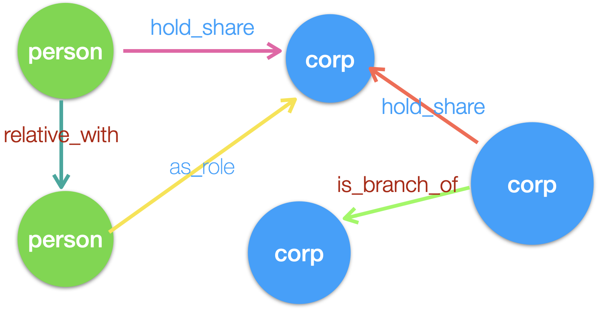
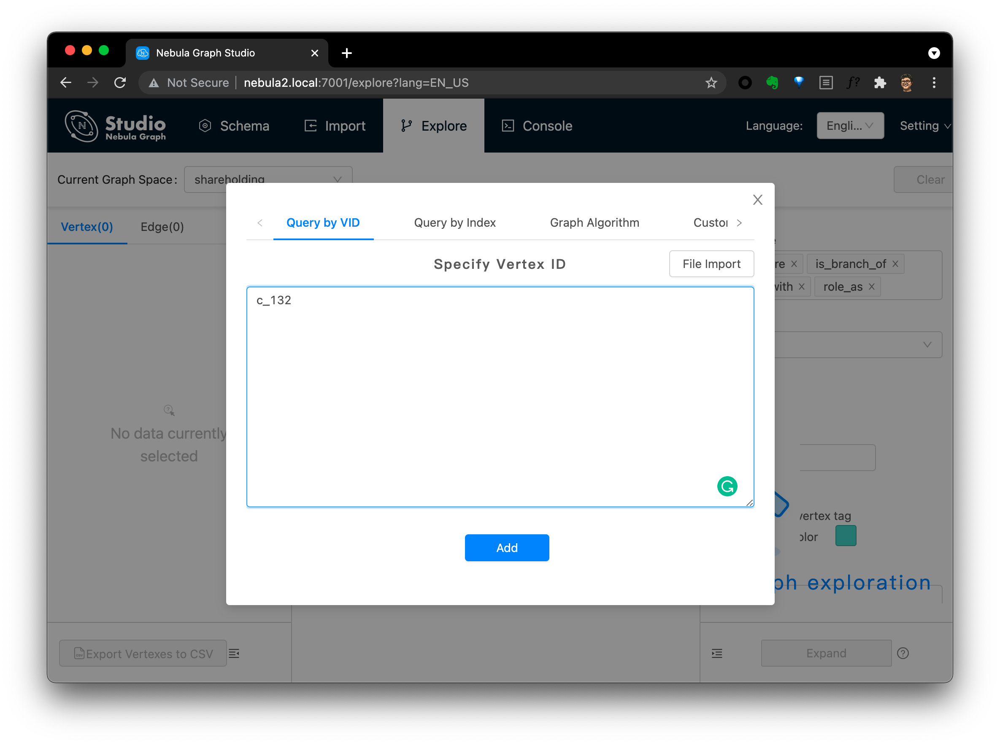
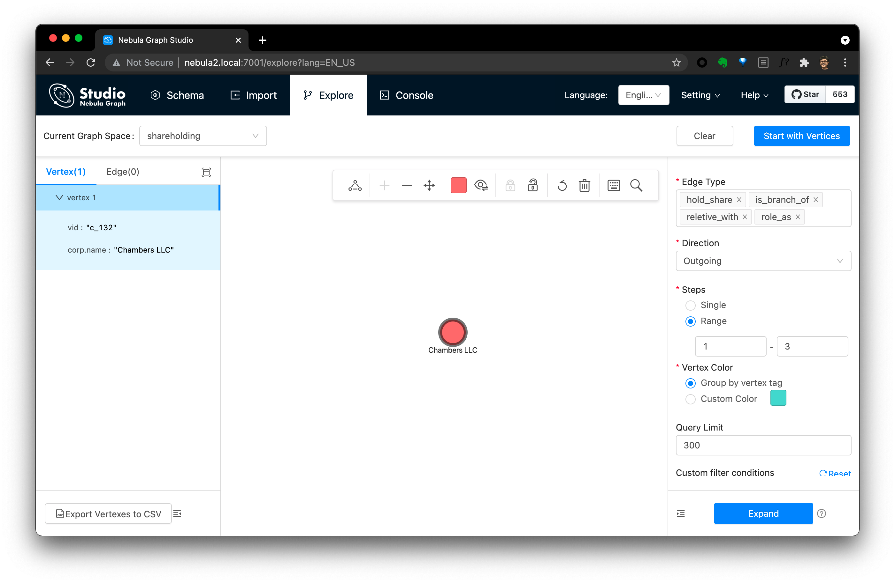
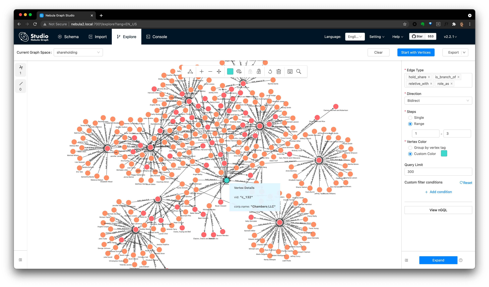

This is a demo of Shareholding Breakthrough with Distributed open-source Graph Database: Nebula Graph.

## Data

### Data Modeling



There are various kinds of relationships when we checking companies' shareholding breakthrough, here let's simplify it with only two kind of entities: person and corp:

- `person` can hold a `corp` in `{share} %`
- `person` can be relative with another `person`
- `corp` can hold another `corp` in `{share} %`
- `corp` can be a branch of another `corp`
- `person` can be as a role of a `corp`

Below is the lines to reflect this graph modele in Nebula Graph, it's quite straightforward, right?

```sql
CREATE TAG person(name string);
CREATE TAG corp(name string);
CREATE EDGE role_as(role string);
CREATE EDGE is_branch_of();
CREATE EDGE hold_share(share float);
CREATE EDGE reletive_with(degree int);
```

### Data Generation

We just randomly generate some data to help with this demo, you can call `data_generator.py` directly to generate or reuse what's already done under `data_sample` folder.

The generated data are records to be fit in above data model from below `.csv` files.

```bash
$ pip install Faker==2.0.5 pydbgen==1.0.5
$ python3 data_generator.py
$ ls -l data
total 1688
-rw-r--r--  1 weyl  staff   23941 Jul 14 13:28 corp.csv
-rw-r--r--  1 weyl  staff    1277 Jul 14 13:26 corp_rel.csv
-rw-r--r--  1 weyl  staff    3048 Jul 14 13:26 corp_share.csv
-rw-r--r--  1 weyl  staff  211661 Jul 14 13:26 person.csv
-rw-r--r--  1 weyl  staff  179770 Jul 14 13:26 person_corp_role.csv
-rw-r--r--  1 weyl  staff  322965 Jul 14 13:26 person_corp_share.csv
-rw-r--r--  1 weyl  staff   17689 Jul 14 13:26 person_rel.csv
```

### Data Import

With those data in `.csv` files, we can easily import them into a Nebula Graph Cluster with the help of [Nebula-Importer](https://github.com/vesoft-inc/nebula-importer).

For Nebula Graph Database, plesae refer to [Doc](https://docs.nebula-graph.io/) , [Doc-CN](https://docs.nebula-graph.com.cn/) to deploy on any Linux Servers, for study and test, you can run it via Docker following the Quick Start Chapter of the documentation.

For Nebula-Importer, if you already have Docker env, you can run it as the following without installing anything. Or, if you prefer to install it, it's quite easy as it's written in Golang and you can run its single file binary quite easily, go check both Documentation and Nebula-Importer Repo: https://github.com/vesoft-inc/nebula-importer.

> Let's start! Below is the commands I used to import our data into a Nebula Graph Database.

```bash
# put generated data & nebula-importor.yaml to nebula-importer server
$ scp -r data nebula_graph_host:~
$ scp nebula-importer.yaml data nebula_graph_host:~/data
$ ssh <nebula_graph_host:>
$ ls -l ${HOME}/data
total 756
-rw-r--r--. 1 wei.gu wei.gu  23941 Jul 14 05:44 corp.csv
-rw-r--r--. 1 wei.gu wei.gu   1277 Jul 14 05:44 corp_rel.csv
-rw-r--r--. 1 wei.gu wei.gu   3048 Jul 14 05:44 corp_share.csv
-rw-r--r--. 1 wei.gu wei.gu   3893 Jul 14 05:44 nebula-importer.yaml
-rw-r--r--. 1 wei.gu wei.gu 211661 Jul 14 05:44 person.csv
-rw-r--r--. 1 wei.gu wei.gu 179770 Jul 14 05:44 person_corp_role.csv
-rw-r--r--. 1 wei.gu wei.gu 322965 Jul 14 05:44 person_corp_share.csv
-rw-r--r--. 1 wei.gu wei.gu  17689 Jul 14 05:44 person_rel.csv

# import data into our 
$ docker run --rm -ti \
    --network=nebula-docker-compose_nebula-net \
    -v ${HOME}/data/nebula-importer.yaml:/root/nebula-importer.yaml \
    -v ${HOME}/data:/root \
    vesoft/nebula-importer:v2 \
    --config /root/nebula-importer.yaml

2021/07/14 05:49:32 --- START OF NEBULA IMPORTER ---
2021/07/14 05:49:32 [WARN] config.go:491: Not set files[0].schema.vertex.vid.Type, reset to default value `string'
...
2021/07/14 05:49:43 [INFO] reader.go:180: Total lines of file(/root/person_corp_role.csv) is: 5000, error lines: 1287
2021/07/14 05:49:43 [INFO] statsmgr.go:61: Done(/root/person_corp_role.csv): Time(11.39s), Finished(12523), Failed(0), Latency AVG(1514us), Batches Req AVG(1824us), Rows AVG(1099.43/s)
2021/07/14 05:49:47 [INFO] statsmgr.go:61: Tick: Time(15.00s), Finished(25807), Failed(0), Latency AVG(1500us), Batches Req AVG(1805us), Rows AVG(1720.46/s)
2021/07/14 05:49:48 [INFO] reader.go:180: Total lines of file(/root/person.csv) is: 10000, error lines: 0
2021/07/14 05:49:48 [INFO] statsmgr.go:61: Done(/root/person.csv): Time(16.10s), Finished(29731), Failed(0), Latency AVG(1505us), Batches Req AVG(1810us), Rows AVG(1847.17/s)
2021/07/14 05:49:50 [INFO] reader.go:180: Total lines of file(/root/person_corp_share.csv) is: 20000, error lines: 0
2021/07/14 05:49:50 [INFO] statsmgr.go:61: Done(/root/person_corp_share.csv): Time(17.74s), Finished(36013), Failed(0), Latency AVG(1531us), Batches Req AVG(1844us), Rows AVG(2030.29/s)
2021/07/14 05:49:50 Finish import data, consume time: 18.25s
2021/07/14 05:49:51 --- END OF NEBULA IMPORTER ---
```


## Corporation sharehold relationship breakthrough

#### Query in nGQL

We can query from corp: `c_132` over `*`(all relationships) in `BIDIRECT`:

```sql
GO 1 TO 3 STEPS FROM "c_132" over * BIDIRECT
```

Below are lines I call this query in [nebula-console](https://github.com/vesoft-inc/nebula-console):

```bash
/ # nebula-console  -addr 192.168.8.128 -port 9669 -user user -password password
2021/07/14 07:07:41 [INFO] connection pool is initialized successfully

Welcome to Nebula Graph!

(user@nebula) [(none)]> show spaces
+--------------------+
| Name               |
+--------------------+
| "basketballplayer" |
+--------------------+
| "shareholding"     |
+--------------------+
Got 2 rows (time spent 3851/4595 us)

Wed, 14 Jul 2021 07:07:57 UTC

(user@nebula) [(none)]> use shareholding
Execution succeeded (time spent 1822/2342 us)

Wed, 14 Jul 2021 07:08:02 UTC

(user@nebula) [shareholding]> GO 1 TO 3 STEPS FROM "c_132" over * BIDIRECT
+--------------+-------------------+-----------------+--------------------+
| role_as._dst | is_branch_of._dst | hold_share._dst | reletive_with._dst |
+--------------+-------------------+-----------------+--------------------+
| "p_2024"     |                   |                 |                    |
+--------------+-------------------+-----------------+--------------------+
| "p_4000"     |                   |                 |                    |
+--------------+-------------------+-----------------+--------------------+
|              |                   | "c_245"         |                    |
+--------------+-------------------+-----------------+--------------------+
|              |                   | "p_1039"        |                    |
+--------------+-------------------+-----------------+--------------------+
|              |                   | "p_1399"        |                    |
+--------------+-------------------+-----------------+--------------------+
|              |                   | "p_1767"        |                    |
...
+--------------+-------------------+-----------------+--------------------+
|              |                   | "c_132"         |                    |
+--------------+-------------------+-----------------+--------------------+
|              |                   | "c_245"         |                    |
+--------------+-------------------+-----------------+--------------------+
|              |                   | "c_25"          |                    |
+--------------+-------------------+-----------------+--------------------+
|              |                   | "c_649"         |                    |
+--------------+-------------------+-----------------+--------------------+
|              |                   | "c_753"         |                    |
+--------------+-------------------+-----------------+--------------------+
Got 1519 rows (time spent 12190/14702 us)

Wed, 14 Jul 2021 07:08:06 UTC

```


#### In a Visual Way

Of course, we can also be done in a visual way:

Step 1, login from Nebula Graph Studio, explore with one VID: `c_132`:



Step2, click this explored vertex dot, then you can explore from select vertices by selecting:

- Edge Type
- Direction
- Steps
- Query Limit(Optional)

> note, you can click the 👁️ icon to add options to show fields of the graph,



Step3, after click Expand, you will see all quried relations with `c_132` the `Chambers LLC`.



## Thanks to Upstream Projects ❤️

- Python Faker https://github.com/joke2k/faker/
- pydbgen https://github.com/tirthajyoti/pydbgen
- Nebula Graph https://github.com/vesoft-inc/nebula-graph


### Tips:

- You can deploy nebula graph in one line with:
  - [Nebula-UP](https://siwei.io/nebula-up/), it helps install a nebula graph with Docker
  - [Nebula-operator-KIND](https://siwei.io/nebula-operator-kind/) , it helps setup all dependencies of Nebula-K8s-Operator including a K8s in Docker, PV Provider and then install a Nebula Graph with Nebula-Operator in K8s.

